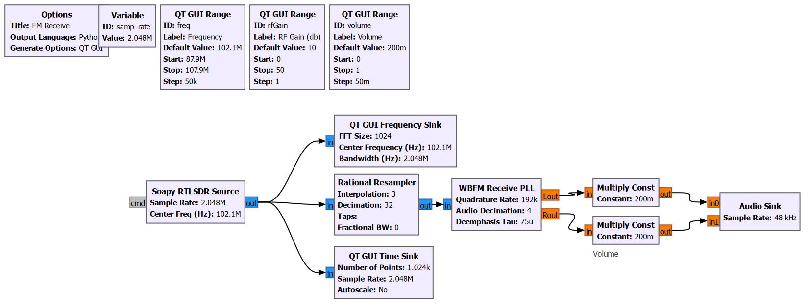

# FM Receiver with GNU Radio & RTL-SDR
*flowgraph* GNU Radio untuk menerima siaran radio FM menggunakan perangkat keras RTL-SDR. Proyek ini mencakup visualisasi sinyal secara real-time dan kontrol parameter dinamis untuk optimasi kualitas audio.

## Fitur Utama
*   **Real-time Monitoring:** Dilengkapi dengan *FFT Plot* dan *Waterfall Display* untuk memantau spektrum frekuensi secara visual.
*   **Dynamic Control:** Pengaturan variabel frekuensi (87.9M - 107.9M), RF Gain, dan volume secara langsung melalui antarmuka QT GUI.
*   **Signal Processing:** Menggunakan *WBFM Receive PLL* untuk demodulasi audio yang stabil.
